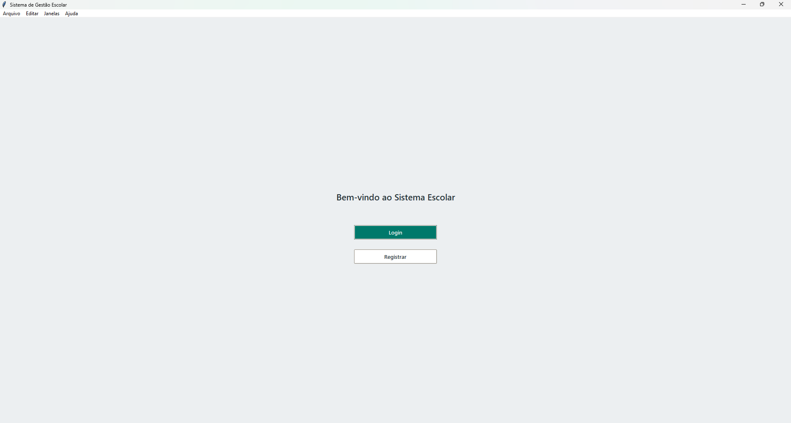
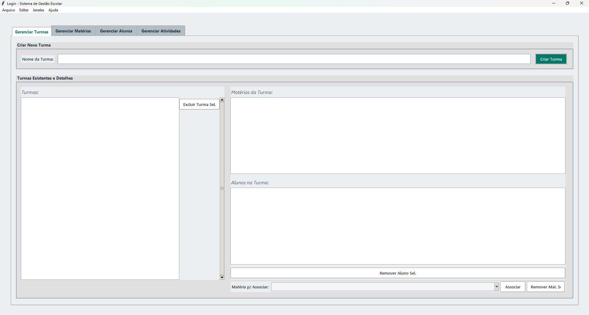
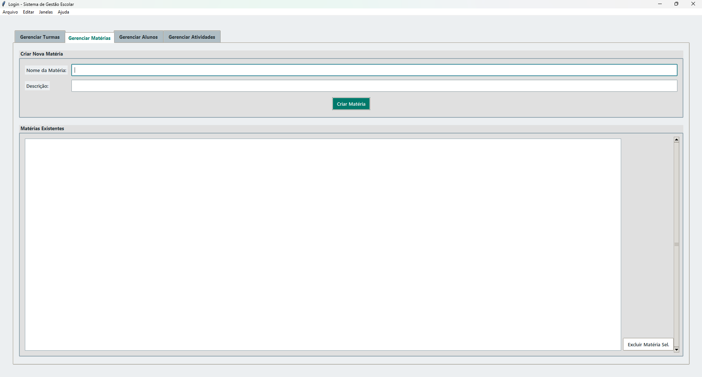
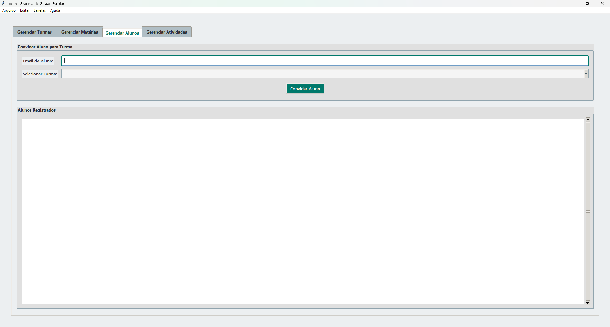
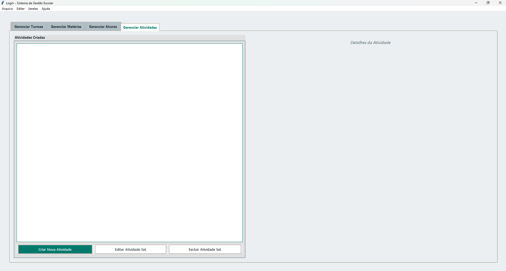
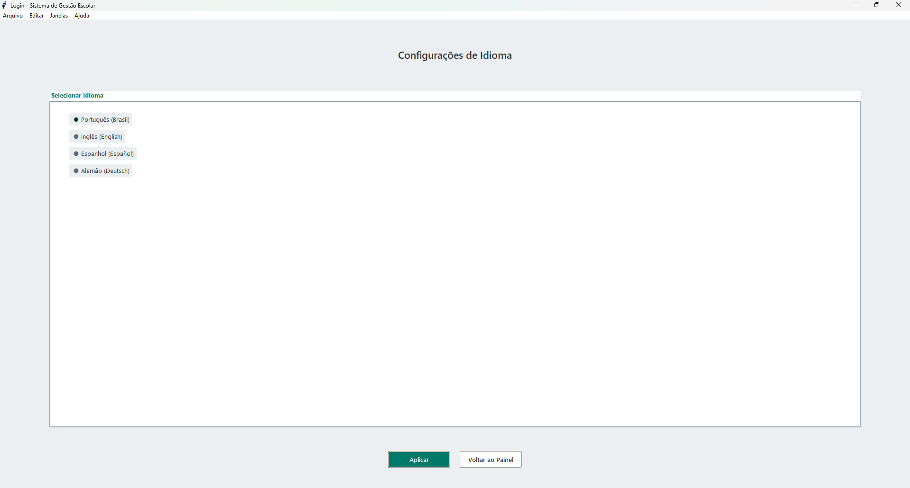
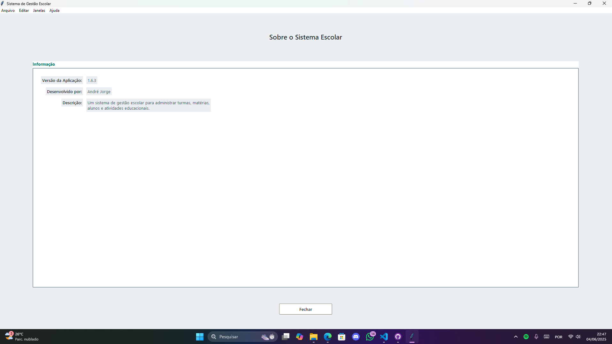

# GEPGIA - Sistema de Gestão Escolar Inteligente 📚✨

**GEPGIA** (acrônimo para **G**estão **E**scolar em **P**ython com **I**nteligência **A**rtificial) é um sistema de desktop robusto e intuitivo, desenvolvido para simplificar e otimizar a administração de instituições de ensino. Criado com Python e com o auxílio de ferramentas de Inteligência Artificial em seu desenvolvimento, o GEPGIA oferece uma solução completa para gerenciar turmas, matérias, alunos e atividades educacionais.

**Versão Atual:** 1.6.3
**Desenvolvido por:** André Jorge
**Repositório GitHub:** [AndrosoftStudio/GEPGIA](https://github.com/AndrosoftStudio/GEPGIA)

---

## 🌟 Funcionalidades Principais

O GEPGIA foi projetado para ser uma ferramenta central na gestão escolar, oferecendo:

* **Autenticação Segura:** Tela de Login e Registro para acesso ao sistema.
* **Gerenciamento de Turmas:**
    * Criação e visualização de turmas.
    * Associação de matérias e alunos a turmas específicas.
    * Detalhes e exclusão de turmas.
* **Gerenciamento de Matérias:**
    * Cadastro de novas matérias com nome e descrição.
    * Listagem e exclusão de matérias existentes.
* **Gerenciamento de Alunos:**
    * Convite de alunos para turmas através do e-mail.
    * Listagem de alunos registrados no sistema.
* **Gerenciamento de Atividades Educacionais:**
    * Criação, edição e exclusão de atividades.
    * Visualização de atividades criadas e seus detalhes.
* **Internacionalização:** Suporte a múltiplos idiomas:
    * Português (Brasil)
    * Inglês (English)
    * Espanhol (Español)
    * Alemão (Deutsch)
* **Interface Intuitiva:** Design limpo e fácil de usar para uma ótima experiência do usuário.
* **Informações do Sistema:** Seção "Sobre" com detalhes da versão e do desenvolvedor.

---

## 🖼️ Screenshots

Clique para ver as telas do sistema

**1. Tela de Boas-vindas e Login:**
*Bem-vindo ao Sistema Escolar. Faça login ou registre-se para continuar.*

**2. Gerenciamento de Turmas:**
*Crie novas turmas, visualize existentes, associe matérias e alunos.*

**3. Gerenciamento de Matérias:**
*Adicione novas matérias com nome e descrição. Visualize e gerencie as matérias existentes.*

**4. Gerenciamento de Alunos:**
*Convide alunos para turmas e veja a lista de alunos registrados.*

**5. Gerenciamento de Atividades:**
*Crie, edite e acompanhe as atividades educacionais.*

**6. Configurações de Idioma:**
*Selecione o idioma de preferência para a interface do sistema.*

**7. Sobre o Sistema Escolar:**
*Informações sobre a versão da aplicação e o desenvolvedor.*

---

## 🛠️ Tecnologias Utilizadas

* **Linguagem Principal:** Python
* **Interface Gráfica (GUI):**
* **Banco de Dados:**
* **Empacotamento:**
* **Desenvolvimento Assistido por IA:** Ferramentas de Inteligência Artificial foram utilizadas para auxiliar no processo de desenvolvimento.

---

## 🚀 Como Começar

Como o GEPGIA é distribuído como um executável, não há necessidade de instalação de dependências ou configuração de ambiente Python para utilizá-lo.

**Para utilizar:**

1.  **Baixe o Executável:**
    * Acesse a seção de [**Releases**](https://github.com/AndrosoftStudio/GEPGIA/releases) no repositório do GitHub.
    * Faça o download da versão mais recente do executável compatível com o seu sistema operacional.

2.  **Execute a Aplicação:**
    * Após o download, localize o arquivo executável (ex: `GEPGIA.exe` no Windows).
    * Dê um duplo clique no arquivo para iniciar o Sistema de Gestão Escolar GEPGIA.

**Observação:** Dependendo do seu sistema operacional e configurações de segurança, você pode precisar conceder permissões para executar o arquivo baixado.

---

## 🗺️ Roadmap (Sugestões)

* [ ] Módulo de Notas e Avaliações
* [ ] Geração de Relatórios (desempenho de alunos, frequência, etc.)
* [ ] Calendário de Eventos Escolares
* [ ] Sistema de Notificações
* [ ] Melhorias na performance e usabilidade com base no feedback dos usuários.

---

## 🤝 Contribuição

Se você deseja contribuir com o código-fonte:

1.  Faça um Fork do projeto em [https://github.com/AndrosoftStudio/GEPGIA](https://github.com/AndrosoftStudio/GEPGIA)
2.  Crie sua Feature Branch (`git checkout -b feature/NovaFuncionalidadeIncrivel`)
3.  Commit suas mudanças (`git commit -m 'Adiciona NovaFuncionalidadeIncrivel'`)
4.  Push para a Branch (`git push origin feature/NovaFuncionalidadeIncrivel`)
5.  Abra um Pull Request

Qualquer contribuição que você fizer será **muito apreciada**!

---

## 📄 Licença

Distribuído sob a Licença MIT. Veja o arquivo `LICENSE` no repositório para mais informações.
*(Certifique-se de que o arquivo LICENSE existe no seu repositório).*

---

## 📞 Contato

André Jorge

Link do Projeto: [https://github.com/AndrosoftStudio/GEPGIA](https://github.com/AndrosoftStudio/GEPGIA)

---

Agradecemos por usar e se interessar pelo GEPGIA!
